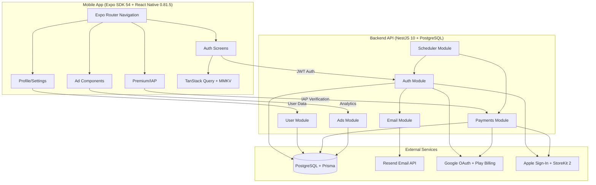

# Design Document

## Overview

The mobile-app-skeleton is a production-ready, cross-platform mobile application framework built with Expo SDK 54, React Native 0.81.5, NestJS 10, and PostgreSQL. The architecture supports two independent modules: a mobile app (iOS/Android/Web) and a backend API. The design emphasizes flexibility through configurable modes (device vs backend authentication, device vs backend payment verification, and freemium vs paid vs unlocked access models), enabling developers to deploy variations without code changes.

The system implements modern authentication (email/code, Google, Apple), in-app purchases with native StoreKit 2 and Google Play Billing integration, advertisement management, user profile management, push notifications, and automated subscription lifecycle management.

## Architecture

### High-Level System Architecture




### Technology Stack

**Mobile App:**
- Expo SDK 54 with React Native 0.81.5 (New Architecture enabled)
- Expo Router for file-based navigation
- TanStack Query (React Query) for server state management
- MMKV for fast key-value storage
- React Native Paper for UI components
- react-hook-form + yup for form validation
- react-native-iap v14+ for in-app purchases
- @react-native-google-signin/google-signin for Google authentication
- expo-apple-authentication for Apple Sign-In

**Backend API:**
- NestJS 10 with TypeScript
- Prisma 6 ORM with PostgreSQL
- JWT for authentication (jsonwebtoken)
- bcrypt for password hashing
- Resend for email delivery
- @nestjs/schedule for cron jobs
- class-validator and class-transformer for validation


**Database:**
- PostgreSQL (production)
- Prisma Client for type-safe queries

## Components and Interfaces

### Backend API Modules

#### Auth Module

**Controllers:**
- `POST /auth/email-login` - Initiate email-based login with verification code
- `POST /auth/verify-code` - Verify 6-digit code and return JWT tokens
- `POST /auth/google` - Authenticate with Google ID token
- `POST /auth/apple` - Authenticate with Apple identity token
- `POST /auth/refresh-token` - Refresh access token using refresh token
- `POST /auth/logout` - Invalidate refresh token
- `GET /auth/profile` - Get current user profile (requires JWT)

**Services:**
- `AuthService` - Core authentication logic, email/code flow, JWT generation
- `GoogleAuthService` - Google ID token verification and user creation
- `AppleAuthService` - Apple identity token verification and user creation

**Guards:**
- `JwtAuthGuard` - Validates JWT access tokens
- `VerifiedEmailGuard` - Ensures user has verified email

**DTOs:**
```typescript
interface EmailLoginDto {
  email: string;
}

interface VerifyCodeDto {
  email: string;
  code: string;
}

interface GoogleLoginDto {
  idToken: string;
}

interface AppleLoginDto {
  identityToken: string;
  fullName?: { firstName?: string; lastName?: string };
}

interface RefreshTokenDto {
  refreshToken: string;
}
```


#### User Module

**Controllers:**
- `GET /users/profile` - Get user profile (requires JWT)
- `PUT /users/profile` - Update user profile (requires JWT + verified email)
- `PUT /users/password` - Change password (requires JWT + verified email)
- `DELETE /users/account` - Delete user account (requires JWT + verified email)

**Services:**
- `UserService` - User CRUD operations, profile management, password changes

**DTOs:**
```typescript
interface UpdateProfileDto {
  nickname?: string;
  email?: string;
  firstName?: string;
  lastName?: string;
  profilePicture?: string;
}

interface ChangePasswordDto {
  currentPassword: string;
  newPassword: string;
}
```

#### Payments Module

**Controllers:**
- `POST /payments/verify-receipt` - Verify iOS/Android receipt (requires JWT)
- `GET /payments/plans` - Get available payment plans
- `GET /payments/:paymentId` - Get payment details (requires JWT)
- `GET /payments/user/payments` - Get user's payment history (requires JWT)
- `GET /payments/user/status` - Get user's premium status (requires JWT)
- `POST /payments/user/cancel-subscription` - Cancel active subscription (requires JWT)
- `POST /payments/webhook` - Handle payment webhooks from stores

**Services:**
- `PaymentsService` - Payment CRUD, subscription management, premium status updates
- `ReceiptVerificationService` - iOS App Store and Android Play Store receipt verification
- `SubscriptionLifecycleService` - Subscription renewal and expiry handling

**DTOs:**
```typescript
interface VerifyReceiptDto {
  platform: 'ios' | 'android';
  receiptData?: string; // iOS base64 receipt
  purchaseToken?: string; // Android purchase token
  productId: string;
  transactionId?: string;
}

interface CreatePaymentDto {
  type: PaymentType;
  amount: number;
  currency: string;
  platformId?: string;
}
```

#### Ads Module

**Controllers:**
- `GET /ads/configs` - Get ad configurations (optional adType filter)
- `POST /ads/configs` - Create or update ad configuration
- `GET /ads/serve/:adType` - Get ad to display (checks premium status)
- `POST /ads/track` - Track ad analytics (impression, click, close, error)
- `GET /ads/analytics` - Get ad analytics (optional date range)
- `PUT /ads/configs/:configId/disable` - Disable ad configuration

**Services:**
- `AdsService` - Ad configuration management, ad serving logic, analytics tracking

**DTOs:**
```typescript
interface UpsertAdConfigDto {
  adType: AdType;
  adNetworkId: string;
  isActive: boolean;
  displayFrequency: number;
}

interface TrackAnalyticsDto {
  adType: AdType;
  action: AdAction;
  adNetworkId: string;
}
```


#### Email Module

**Services:**
- `EmailService` - Email sending via Resend API, dev mode console logging

**Methods:**
```typescript
interface EmailService {
  sendVerificationCode(email: string, code: string): Promise<void>;
  sendPasswordReset(email: string, token: string): Promise<void>;
  sendWelcomeEmail(email: string, nickname: string): Promise<void>;
}
```

#### Scheduler Module

**Services:**
- `SchedulerService` - Cron jobs for maintenance tasks

**Jobs:**
- Daily session cleanup (removes expired sessions)
- Daily subscription expiry check (updates premium status)

### Mobile App Structure

#### Navigation (Expo Router)

File-based routing structure:
```
app/
  _layout.tsx                    # Root layout with providers + PaywallGate
  index.tsx                      # Entry point / router
  (auth)/
    welcome.tsx                  # Welcome screen (Google/Apple sign-in, email in backend mode only)
    verify-code.tsx              # 6-digit code verification (backend mode only)
  (main)/
    _layout.tsx                  # Authenticated layout with bottom tabs
    home.tsx                     # Home screen
    profile.tsx                  # Profile screen with premium status
    settings.tsx                 # Settings screen
    premium.tsx                  # Premium/IAP screen
    components.tsx               # Component showcase (dev-only)
    language-settings.tsx        # Language selection
    notifications-settings.tsx   # Notification preferences (placeholder)
    security-settings.tsx        # Security settings
```

**Note:** There are no separate login.tsx or register.tsx screens. The welcome screen handles all auth flows (Google, Apple, email). Email login is hidden when `authMode: 'device'`.

#### State Management

**TanStack Query Hooks:**
```typescript
// Auth queries
useEmailLogin()
useVerifyCode()
useGoogleLogin()
useAppleLogin()
useRefreshToken()
useLogout()

// User queries
useProfile()
useUpdateProfile()
useChangePassword()
useDeleteAccount()

// Payment queries
useVerifyReceipt()
usePaymentPlans()
useUserPayments()
useUserPremiumStatus()
useCancelSubscription()

// Ad queries
useTrackAdAnalytics()
```

**Storage Strategy:**
```typescript
// expo-secure-store — authentication tokens (encrypted)
// MMKV — user preferences, non-sensitive cached data
// AsyncStorage — device-mode premium status, debug flags

// Device-mode premium status (AsyncStorage)
'@iap_device_premium_status' → { hasPremium: boolean, type: 'PREMIUM_LIFETIME' | 'PREMIUM_SUBSCRIPTION', purchaseDate: string }
'@iap_debug_force_free' → 'true' // Debug flag to reset premium in dev

// User data in device auth mode (tokenService/AsyncStorage)
'@user_data' → { id, email, name, photo } // From Google/Apple sign-in
```

#### UI Components

**Authentication Components:**
- `GoogleSignInButton` - Native Google Sign-In button
- `AppleSignInButton` - Native Apple Sign-In button (iOS only)
- `AuthProvider` - Context provider for auth state (via `useAuth` hook)

**Payment Components:**
- `PaywallGate` - Wraps root layout; shows full-screen PremiumScreen when `accessMode === 'paid'` and user is not premium; bypasses for `freemium` and `unlocked`
- `PremiumScreen` - IAP purchase screen with product listings, features, and purchase buttons

**Ad Components:**
- `useAdManager` hook - Manages ad loading, display state, and analytics tracking
- `useAd` hook - Fetches ad config (backend) or returns SAMPLE_ADS (device mode) with 2s timeout
- `useTrackAdAnalytics` hook - Tracks analytics (backend mode) or no-ops (device mode)
- `useShouldShowAds` hook - Checks premium status via AsyncStorage (device) or API (backend)

**Reusable Themed UI Library (`src/components/ui/`):**

All components use `useAppTheme()` exclusively — never hardcoded colors.

| Component | Description |
|-----------|-------------|
| `SearchInput` | Full-width search bar with icon and optional mic button |
| `CategoryGrid` | Horizontal row of icon + label category items |
| `DataCard` | Rich card with title, subtitle, calorie badge, macro breakdown |
| `CompactDataCard` | Minimal card with title, macros summary, calorie count |
| `MetricBadge` | Colored badge showing label and value |
| `ProgressRing` | SVG circular progress indicator (requires `react-native-svg`) |
| `StatGrid` | Two-column grid of label/value pairs |
| `InfoBanner` | Alert-style banner with icon (info/warning/success/error variants) |
| `ChipSelector` | Horizontal row of selectable chips (single selection) |
| `FeatureBadge` | Icon + title + description row for feature lists |
| `SectionHeader` | Uppercase section title with optional action button |

`ComponentShowcase` screen available at `app/(main)/components.tsx` (dev-only, accessed via subtle text link on WelcomeScreen and HomeScreen).


## Data Models

### Prisma Schema

```prisma
model User {
  id                  String          @id @default(cuid())
  email               String          @unique
  nickname            String
  passwordHash        String?
  googleId            String?         @unique
  appleId             String?         @unique
  profilePicture      String?
  firstName           String?
  lastName            String?
  isVerified          Boolean         @default(false)
  isEmailVerified     Boolean         @default(false)
  verificationToken   String?
  passwordResetToken  String?
  passwordResetExpiry DateTime?
  premiumStatus       PremiumStatus   @default(FREE)
  premiumExpiry       DateTime?
  isPremium           Boolean         @default(false)
  createdAt           DateTime        @default(now())
  updatedAt           DateTime        @updatedAt
  
  payments            Payment[]
  sessions            Session[]
  refreshTokens       RefreshToken[]
  adAnalytics         AdAnalytics[]
  
  @@map("users")
}

model Payment {
  id                    String        @id @default(cuid())
  userId                String
  type                  PaymentType
  amount                Float
  currency              String
  status                PaymentStatus
  platformId            String?
  platform              String?
  storeSku              String?
  transactionId         String?
  originalTransactionId String?
  purchaseToken         String?       @unique
  receiptData           String?       @db.Text
  purchaseDate          DateTime?
  expiryDate            DateTime?
  createdAt             DateTime      @default(now())
  
  user                  User          @relation(fields: [userId], references: [id], onDelete: Cascade)
  
  @@index([userId, status])
  @@index([transactionId])
  @@index([originalTransactionId])
  @@map("payments")
}

model Session {
  id        String   @id @default(cuid())
  userId    String
  token     String   @db.VarChar(512) @unique
  expiresAt DateTime
  createdAt DateTime @default(now())
  
  user      User     @relation(fields: [userId], references: [id], onDelete: Cascade)
  
  @@map("sessions")
}

model AuthCode {
  id        String   @id @default(uuid())
  email     String
  code      String
  expiresAt DateTime
  attempts  Int      @default(0)
  used      Boolean  @default(false)
  createdAt DateTime @default(now())
  
  @@map("auth_codes")
}

model RefreshToken {
  id        String   @id @default(cuid())
  token     String   @unique
  userId    String
  expiresAt DateTime
  createdAt DateTime @default(now())
  
  user      User     @relation(fields: [userId], references: [id], onDelete: Cascade)
  
  @@map("refresh_tokens")
}

model AppConfig {
  id                String       @id @default(cuid())
  appName           String
  primaryColor      String
  secondaryColor    String
  logoUrl           String?
  paymentModel      PaymentModel
  subscriptionPrice Float?
  oneTimePrice      Float?
  createdAt         DateTime     @default(now())
  updatedAt         DateTime     @updatedAt
  
  @@map("app_configs")
}

model AdConfig {
  id               String   @id @default(cuid())
  adType           AdType
  adNetworkId      String
  isActive         Boolean  @default(true)
  displayFrequency Int      @default(1)
  createdAt        DateTime @default(now())
  updatedAt        DateTime @updatedAt
  
  @@map("ad_configs")
}

model AdAnalytics {
  id          String   @id @default(cuid())
  userId      String?
  adType      AdType
  action      AdAction
  adNetworkId String
  timestamp   DateTime @default(now())
  
  user        User?    @relation(fields: [userId], references: [id], onDelete: SetNull)
  
  @@map("ad_analytics")
}

enum PremiumStatus {
  FREE
  PREMIUM_SUBSCRIPTION
  PREMIUM_LIFETIME
}

enum PaymentType {
  SUBSCRIPTION
  ONE_TIME
}

enum PaymentStatus {
  PENDING
  COMPLETED
  FAILED
  CANCELLED
}

enum PaymentModel {
  SUBSCRIPTION_ONLY
  ONE_TIME_ONLY
  BOTH
}

enum AdType {
  BANNER
  INTERSTITIAL
}

enum AdAction {
  IMPRESSION
  CLICK
  CLOSE
  ERROR
}
```


### Configuration Models

**App Configuration (Mobile):**
```typescript
interface AppConfig {
  authMode: 'device' | 'backend';
}

interface IAPConfig {
  paymentMode: 'device' | 'backend';
  accessMode: 'freemium' | 'paid' | 'unlocked';
  ios: {
    subscriptions: string[];
    oneTime: string[];
  };
  android: {
    subscriptions: string[];
    oneTime: string[];
  };
}

// Actual theme structure in src/config/theme.ts
interface AppTheme {
  brand: {
    primary: string;    // '#2BEE3B' — main brand color
    secondary: string;  // '#1A2E1C' — dark accent
    accent: string;     // '#3B82F6' — secondary accent (blue)
  };
  status: {
    success: string; error: string; warning: string; info: string;
  };
  light: {  // Light palette
    background: string;      // '#F2F5F3'
    surface: string;
    text: string;
    textSecondary: string;   // '#526356' (solid, not opacity-based)
    inputBackground: string; // '#E8EDE9'
    cardBackground: string;
    border: string;          // '#B4C5B7'
    borderVariant: string;   // '#C8D5CA'
    // ... additional tokens
  };
  dark: {  // Dark palette
    background: string;      // '#102212'
    // ... mirrors light structure
  };
  shape: { borderRadius: { sm; md; lg; xl; full } };
  typography: { fontSize: { xs; sm; md; lg; xl; xxl; hero } };
}
```

**Environment Variables (Backend):**
```typescript
interface BackendEnv {
  DATABASE_URL: string;
  JWT_SECRET: string;
  JWT_EXPIRES_IN: string; // '30d'
  REFRESH_TOKEN_EXPIRES_IN: string; // '365d'
  RESEND_API_KEY: string;
  EMAIL_FROM: string;
  EMAIL_DEV_MODE: boolean;
  GOOGLE_CLIENT_ID: string;
  GOOGLE_CLIENT_SECRET: string;
  APPLE_CLIENT_ID: string;
  APPLE_TEAM_ID: string;
  APPLE_KEY_ID: string;
  APPLE_PRIVATE_KEY: string;
}
```

## Error Handling

### Backend Error Handling

**HTTP Status Codes:**
- 200 OK - Successful request
- 201 Created - Resource created successfully
- 400 Bad Request - Validation error or invalid input
- 401 Unauthorized - Invalid or missing JWT token
- 403 Forbidden - User lacks required permissions (e.g., email not verified)
- 404 Not Found - Resource not found
- 409 Conflict - Duplicate resource (e.g., email already exists)
- 500 Internal Server Error - Unexpected server error

**Error Response Format:**
```typescript
interface ErrorResponse {
  success: false;
  error: {
    code: string;
    message: string;
    details?: any;
  };
}
```

**Common Error Codes:**
- `AUTH_INVALID_CODE` - Verification code is invalid or expired
- `AUTH_MAX_ATTEMPTS` - Maximum verification attempts reached
- `AUTH_INVALID_TOKEN` - JWT token is invalid or expired
- `AUTH_EMAIL_EXISTS` - Email already registered
- `USER_NOT_FOUND` - User does not exist
- `PAYMENT_VERIFICATION_FAILED` - Receipt verification failed
- `PAYMENT_ALREADY_PROCESSED` - Receipt already processed
- `AD_CONFIG_NOT_FOUND` - Ad configuration not found

### Mobile App Error Handling

**Network Errors:**
- Automatic retry with exponential backoff (TanStack Query)
- Offline detection and cached data fallback
- User-friendly error messages

**Validation Errors:**
- Real-time form validation with yup schemas
- Field-level error display
- Submit button disabled until valid

**IAP Errors:**
- Store connection errors
- Receipt verification failures
- Subscription status sync issues
- Clear error messages with retry options

**Ad Errors:**
- Ad loading failures handled gracefully
- No app crash if ads fail
- Fallback to no-ad experience


## Testing Strategy

### Backend Testing

**Unit Tests (Jest/Vitest):**
- Service layer methods (AuthService, UserService, PaymentsService, etc.)
- Utility functions (password hashing, token generation, email formatting)
- DTO validation logic
- Guard logic (JwtAuthGuard, VerifiedEmailGuard)

**Integration Tests:**
- API endpoint testing with Supertest
- Database operations with test database
- External service mocking (Resend, Google OAuth, Apple Sign-In)
- Receipt verification service testing

**Test Coverage Goals:**
- Minimum 80% code coverage for critical paths
- 100% coverage for authentication and payment flows
- All error paths tested

**Example Test Structure:**
```typescript
describe('AuthService', () => {
  describe('emailLogin', () => {
    it('should generate 6-digit code', async () => {
      const result = await authService.emailLogin('test@example.com');
      expect(result.code).toMatch(/^\d{6}$/);
    });
    
    it('should send email with code', async () => {
      await authService.emailLogin('test@example.com');
      expect(emailService.sendVerificationCode).toHaveBeenCalled();
    });
    
    it('should set expiration to 10 minutes', async () => {
      const result = await authService.emailLogin('test@example.com');
      const expiresAt = new Date(result.expiresAt);
      const now = new Date();
      const diff = (expiresAt.getTime() - now.getTime()) / 1000 / 60;
      expect(diff).toBeCloseTo(10, 0);
    });
  });
  
  describe('verifyCode', () => {
    it('should return JWT tokens for valid code', async () => {
      // Setup: create code
      await authService.emailLogin('test@example.com');
      
      // Test: verify code
      const result = await authService.verifyCode('test@example.com', '123456');
      
      expect(result.accessToken).toBeDefined();
      expect(result.refreshToken).toBeDefined();
    });
    
    it('should reject expired code', async () => {
      // Setup: create expired code
      await prisma.authCode.create({
        data: {
          email: 'test@example.com',
          code: '123456',
          expiresAt: new Date(Date.now() - 1000),
        },
      });
      
      // Test: verify expired code
      await expect(
        authService.verifyCode('test@example.com', '123456')
      ).rejects.toThrow('Code expired');
    });
  });
});
```

### Mobile App Testing

**Unit Tests (Jest):**
- Custom hooks (useAuth, useIAP, useAds)
- Utility functions (storage helpers, validation functions)
- Component logic (form validation, state management)
- Configuration parsing

**Integration Tests (React Native Testing Library):**
- Screen rendering and navigation
- Form submission flows
- Authentication flows
- IAP purchase flows
- Ad display logic

**E2E Tests (Detox - Optional):**
- Complete user registration and login flow
- Premium purchase flow
- Profile update flow
- Ad interaction flow

**Example Test Structure:**
```typescript
describe('useEmailLogin', () => {
  it('should send verification code', async () => {
    const { result } = renderHook(() => useEmailLogin());
    
    await act(async () => {
      await result.current.mutateAsync({ email: 'test@example.com' });
    });
    
    expect(result.current.isSuccess).toBe(true);
  });
  
  it('should handle network errors', async () => {
    // Mock network failure
    server.use(
      http.post('/auth/email-login', () => {
        return HttpResponse.error();
      })
    );
    
    const { result } = renderHook(() => useEmailLogin());
    
    await act(async () => {
      try {
        await result.current.mutateAsync({ email: 'test@example.com' });
      } catch (error) {
        // Expected
      }
    });
    
    expect(result.current.isError).toBe(true);
  });
});
```

### Test Environments

**Development:**
- Local PostgreSQL database
- Mock external services (Resend, Google, Apple)
- Console logging for emails (EMAIL_DEV_MODE=true)

**CI/CD:**
- Docker PostgreSQL container
- Automated test runs on pull requests
- Code coverage reporting

**Staging:**
- Production-like environment
- Real external service integration
- Manual testing before production deployment


## Security Considerations

### Authentication Security

**JWT Token Management:**
- Access tokens: 30-day expiration (short-lived for security)
- Refresh tokens: 365-day expiration (long-lived for convenience)
- Tokens stored securely in MMKV on mobile
- Refresh token rotation on each use
- Token invalidation on logout

**Password Security:**
- bcrypt hashing with salt rounds (10+)
- Minimum password requirements enforced
- Current password verification for password changes
- No password storage in plain text

**OAuth Security:**
- Google ID token verification with Google's servers
- Apple identity token verification
- Unique constraint on googleId and appleId
- No storage of OAuth tokens, only user identifiers

### API Security

**Guards and Middleware:**
- JwtAuthGuard validates all protected endpoints
- VerifiedEmailGuard ensures email verification for sensitive operations
- Rate limiting to prevent abuse (recommended)
- CORS configuration for allowed origins

**Input Validation:**
- class-validator for DTO validation
- SQL injection prevention via Prisma parameterized queries
- XSS prevention via content sanitization

### Data Protection

**Sensitive Data:**
- Passwords hashed with bcrypt
- JWT secrets stored in environment variables
- iOS receipts encrypted at rest (receiptData field)
- No PII in logs

**Database Security:**
- Cascade deletes for user data cleanup
- Unique constraints on email, googleId, appleId
- Foreign key constraints for referential integrity
- Connection pooling for performance and security

### Mobile App Security

**Secure Storage:**
- expo-secure-store for authentication tokens (encrypted)
- MMKV for fast key-value storage (preferences, cached data)
- AsyncStorage for device-mode premium status (`@iap_device_premium_status`) and debug flags — not sensitive data, just purchase state

**Network Security:**
- HTTPS/TLS for all API communications
- Certificate pinning (recommended for production)
- API key obfuscation in production builds

**Code Security:**
- Code obfuscation for production builds
- ProGuard/R8 for Android
- Bitcode for iOS (if applicable)
- No hardcoded secrets in source code

## Performance Optimization

### Backend Optimization

**Database Performance:**
- Indexes on frequently queried fields (userId, status, transactionId)
- Connection pooling via Prisma
- Efficient queries with Prisma select and include
- Pagination for large result sets

**Caching Strategy:**
- TanStack Query caching on mobile app
- Redis caching for frequently accessed data (optional)
- Ad configuration caching
- Payment plan caching

**API Performance:**
- Response compression (gzip)
- Efficient JSON serialization
- Async/await for non-blocking operations
- Background jobs for heavy tasks (scheduler)

### Mobile App Optimization

**Rendering Performance:**
- React Native New Architecture for improved performance
- Lazy loading of screens with Expo Router
- Memoization of expensive computations
- FlatList for large lists with virtualization

**Network Performance:**
- TanStack Query for request deduplication
- Automatic retry with exponential backoff
- Offline-first architecture with cached data
- Optimistic updates for better UX

**Bundle Size:**
- Code splitting with Expo Router
- Tree shaking for unused code
- Image optimization and compression
- Lazy loading of heavy dependencies

### Monitoring and Analytics

**Backend Monitoring:**
- Error tracking with Sentry (recommended)
- Performance monitoring with APM tools
- Database query performance monitoring
- API response time tracking

**Mobile App Monitoring:**
- Crash reporting with Sentry or Crashlytics
- Performance monitoring with Firebase Performance
- User analytics (with privacy considerations)
- IAP transaction monitoring

## Deployment Architecture

### Backend Deployment

**Infrastructure:**
- Node.js server (NestJS)
- PostgreSQL database
- Environment-based configuration
- Docker containerization (optional)

**Deployment Options:**
- Heroku, Railway, Render (PaaS)
- AWS EC2, Google Cloud Compute (IaaS)
- Vercel, Netlify (serverless)
- Docker + Kubernetes (enterprise)

**Database Hosting:**
- Heroku Postgres
- AWS RDS PostgreSQL
- Google Cloud SQL
- Supabase (managed PostgreSQL)

### Mobile App Deployment

**iOS:**
- App Store Connect
- TestFlight for beta testing
- EAS Build for cloud builds
- Expo Updates for OTA updates

**Android:**
- Google Play Console
- Internal testing track
- EAS Build for cloud builds
- Expo Updates for OTA updates

**Web:**
- Static hosting (Vercel, Netlify)
- CDN for assets
- Progressive Web App (PWA) support

## Configuration Management

### Environment-Based Configuration

**Development:**
- Local PostgreSQL database
- EMAIL_DEV_MODE=true (console logging)
- Mock external services
- Debug logging enabled

**Staging:**
- Staging database
- Real email sending
- Real OAuth providers
- Production-like configuration

**Production:**
- Production database with backups
- Real email sending via Resend
- Real OAuth and IAP verification
- Error tracking and monitoring
- Optimized builds

### Feature Flags

**Auth Mode:**
- `device`: Local-only authentication (no backend)
- `backend`: Full backend authentication with JWT

**Payment Mode:**
- `device`: StoreKit 2 on-device verification (iOS)
- `backend`: Backend receipt verification (iOS + Android)

**Access Mode:**
- `freemium`: Free app with ads, optional premium
- `paid`: Free download, IAP required for access
- `unlocked`: Paid App Store download, no IAP/ads

### White-Label Configuration

**Theme Customization:**
- Primary and secondary colors
- Logo and branding assets
- Font family and sizes
- Custom splash screen

**Feature Toggles:**
- Enable/disable Google Sign-In
- Enable/disable Apple Sign-In
- Enable/disable email authentication
- Enable/disable ads
- Enable/disable subscriptions vs one-time purchases

**App Metadata:**
- App name and description
- Bundle identifier
- Version number
- Store listings and screenshots
